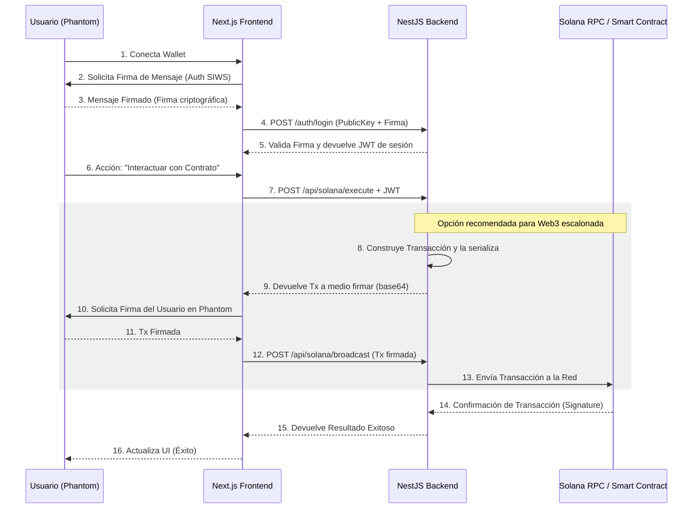

# Plan de Integración: Solana + NestJS + Next.js

Esta es la propuesta arquitectónica y el plan de implementación para integrar un Smart Contract en Solana con un backend en NestJS y un frontend en Next.js, siguiendo las mejores prácticas de seguridad y escalabilidad.

## 1. Arquitectura y Flujo de Datos

El flujo propuesto asegura que la autenticación es robusta y define claramente cómo se construyen, firman y envían las transacciones a la blockchain.

## 2. Seguridad

1. **Autenticación (Sign-In With Solana):** No confiaremos en que el frontend simplemente mande una `publicKey`. El usuario deberá firmar un mensaje con un nonce generado por el backend. El backend validará esta firma usando `tweetnacl` o `@solana/wallet-standard-features`.
2. **Construcción vs Envío:** El backend y el frontend se separan responsabilidades. El backend (NestJS) construye la transacción (porque conoce la lógica de negocio y mantiene el IDL completo), el usuario la firma en el frontend (para no compartir llaves privadas), y el backend la retransmite a la blockchain (para auditar y almacenar datos en BD de inmediato).
3. **Firmas de Backend (Opcional):** Si el protocolo requiere que el backend pague comisiones (Fee Payer) o firme como admin, el backend añadirá su firma localmente (usando su `Keypair` protegido en variables de entorno) antes o después de la firma del usuario.

## 3. Componentes a Desarrollar

### [Backend] NestJS
- **`SolanaModule`:** Módulo contenedor.
- **`SolanaService`:** 
  - Conexión a `Connection` de `@solana/web3.js`.
  - Integración de IDL (`@coral-xyz/anchor`).
  - Lógica para preparar instrucciones (ex: `program.methods.miMetodo().instruction()`).
  - Lecturas de cuentas (ex: `program.account.userState.fetch(pubkey)`).
- **`SolanaController`:**
  - `POST /solana/execute`: Endpoint para iniciar la creación de la tx.
  - `GET /solana/account/:pubkey`: Endpoint de lectura.

### [Frontend] Next.js (App Router)
- **`SolanaProvider`:** Configuración de `ConnectionProvider` y `WalletProvider`.
- **Integración Wallet:** Botón genérico (estilo WalletMultiButton) o custom para conectar Phantom.
- **Acciones:** Lógica donde el usuario presiona el botón, llama al backend para armar la tx, pide al usuario firmarla (`signTransaction`) y llama al backend para enviarla.

### [Bonus] Eventos de Solana en Tiempo Real
- El `SolanaService` utilizará `program.addEventListener` para escuchar eventos.
- Crearemos un `EventsGateway` (WebSockets) en NestJS para notificar al frontend tan pronto como Solana emita el evento del contrato.

## User Review Required

> [!IMPORTANT]
> Decisiones Arquitectónicas antes de generar el código.

1. **Firma de Transacciones:** He propuesto que el **Backend construya la transacción**, luego el **Frontend (Usuario) la firme** y la devuelva al Backend para retransmitirla. ¿Estás de acuerdo o prefieres que el usuario simplemente pulse un botón, y el Backend se encargue de firmar con una *Wallet Administradora* sin requerir validación Phantom?
2. **Generación de Código:** Si apruebas el diagrama fluido y la arquitectura general, podemos proceder a que te proporcione los tres bloques de código principales (Módulo NestJS con su servicio/controlador, las vistas en NextJS + Provider, y el flujo de conexión). ¿Deseas que genere el código directamente ahora?
